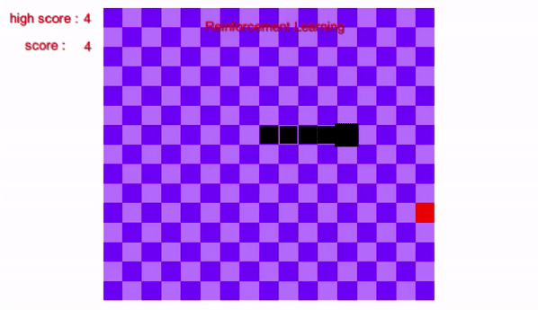

# 3 dimensions snake game

It is a game that is made easier for users to see the locations of the fruit and the snake by using Azure Kinect.

## Requiremnets
- EMGU.CV
- K4AdotNet
- ZedGraph

## Image

## Todo
- [x] [Reinforcement Learning in 2 dimensions snake game](https://github.com/sammiee5311/3_dimensions_snake_game/tree/main/2d_practice)
- 
- [ ] Reinforcement Learning in 3 dimensions snake game

### Reference
- [Sharp Accent](https://www.youtube.com/channel/UCq9_1E5HE4c_xmhzD3r7VMw)
- [Parallaxe](https://github.com/RymOUENZAR/Parallax)
- [k4a.net](https://github.com/bibigone/k4a.net)