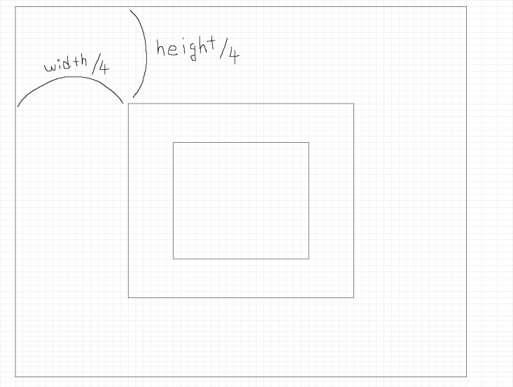

# image_tracking (In Progess)

image_tracking with distorted images by using head pose(yaw, roll and pitch).  

#### yaw, roll, pitch

#### base_image_size
+ width, height = original_image.shape
+ base_width_start = width // 4
+ base_width_end = width // 4 * 3
+ base_height_start = height // 4
+ base_height_ebd = height // 4 * 3

#### inner_base_image_size
+ width, height = base_image.shape
+ inner_base_width_start = width // 4
+ inner_base_width_end = width // 4 * 3
+ inner_base_height_start = height // 4
+ inner_base_height_ebd = height // 4 * 3
